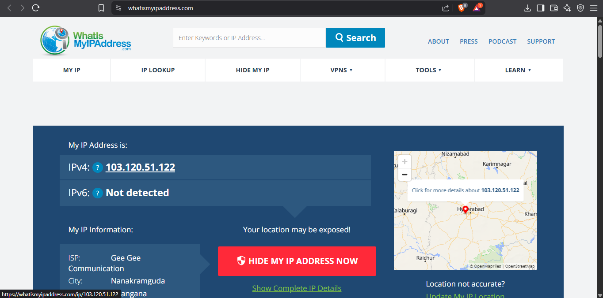
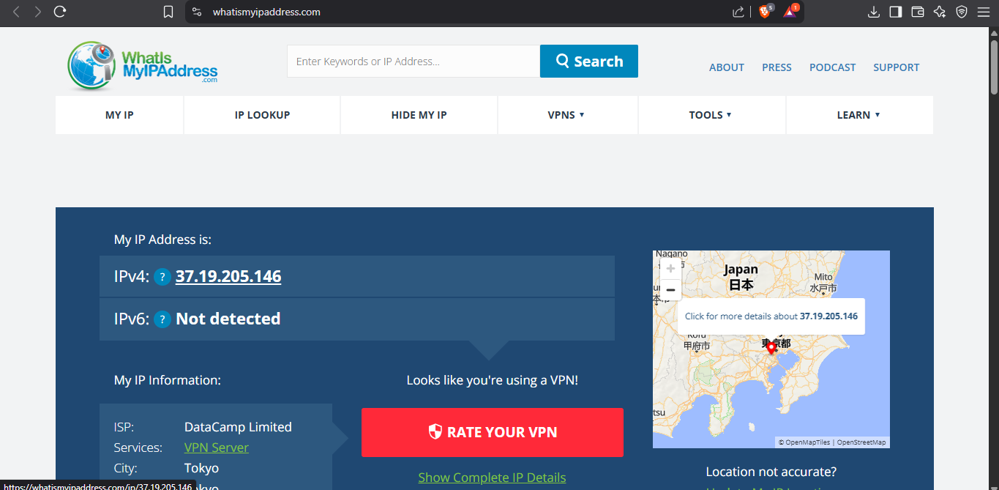
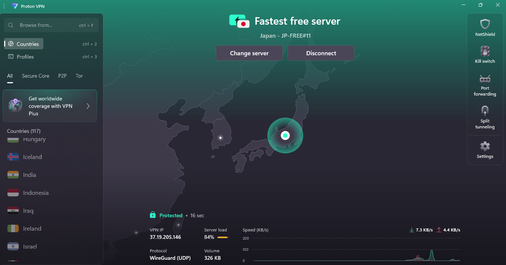

# 🚀 Cyber Security Internship – Task 8: VPN Setup & Privacy Analysis

## 🧠 Objective
Understand and experience how **VPNs** protect user privacy, encrypt internet traffic, and alter IP addresses to secure communication. This hands-on task involved using a **free VPN**, verifying IP address changes, and observing the effects of encryption.

---

## 🛠 Tools Used
- 🔐 **VPN Service**: [ProtonVPN – Free Tier](https://protonvpn.com/free-vpn)
- 🌐 **IP Checker**: [WhatIsMyIPAddress.com](https://whatismyipaddress.com)
- 🖥 OS: Windows 10

---

## 📋 Task Steps

### ✅ Step 1: VPN Installation & Setup
- Created a free account on ProtonVPN.
- Downloaded and installed the ProtonVPN client.
- Logged in with credentials.

### ✅ Step 2: VPN Connection
- Connected to a **free Netherlands server**.
- Verified VPN was active in the app.

### ✅ Step 3: IP Address Verification
- Opened [whatismyipaddress.com](https://whatismyipaddress.com).
- Took a screenshot of the **VPN IP address**.
- Disconnected VPN, checked again, and took screenshot of the **original IP**.

### ✅ Step 4: Speed & Security Check
- Browsed websites with and without VPN.
- Noticed slightly slower speed with VPN (expected due to encryption).
- Verified secure HTTPS traffic when connected.

### ✅ Step 5: Research
- Researched **VPN encryption (AES-256)** and **tunneling protocols** like:
  - OpenVPN
  - IKEv2/IPSec
  - WireGuard

---

## 🖼 Screenshots

| VPN Status | Screenshot |
|------------|------------|
| Original IP |  |
| VPN Connected IP |  |
| ProtonVPN UI |  |

---

## 📌 VPN Benefits

- ✅ Hides real IP address.
- ✅ Encrypts internet traffic for privacy.
- ✅ Protects users on public Wi-Fi.
- ✅ Helps bypass geo-restrictions.

## ⚠ VPN Limitations

- ❌ Can slow down internet speed.
- ❌ May not work with all services (e.g., some streaming).
- ❌ VPN providers may log data (choose reputable ones).
- ❌ Doesn’t ensure full anonymity (browser & DNS leaks possible).

---

## 🎯 Key Learnings

- Understood practical **VPN usage**.
- Experienced **IP masking** and **encrypted browsing**.
- Learned the importance of **VPN protocols** and **privacy features**.
- Realized that VPNs are essential but not a complete solution for anonymity.

---
